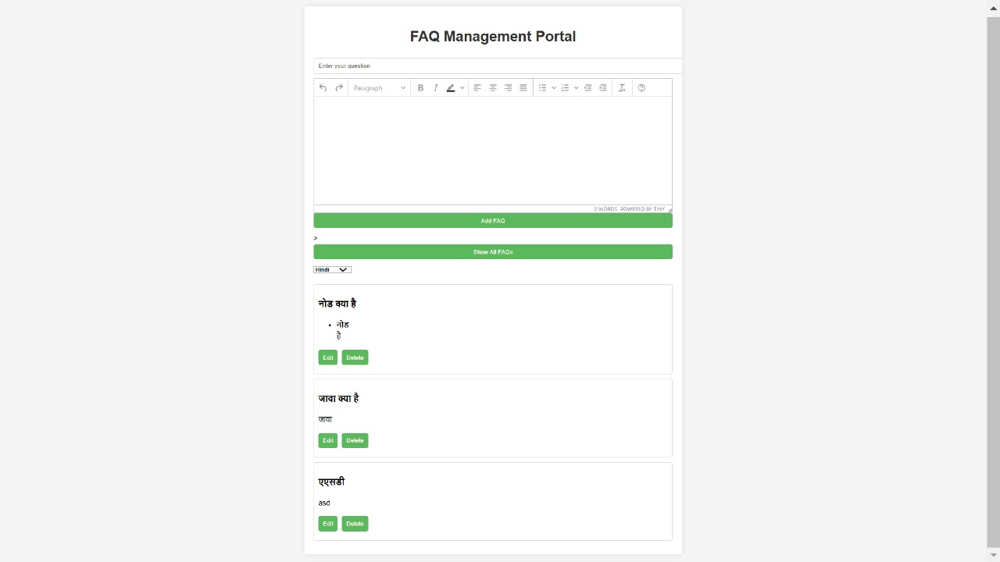
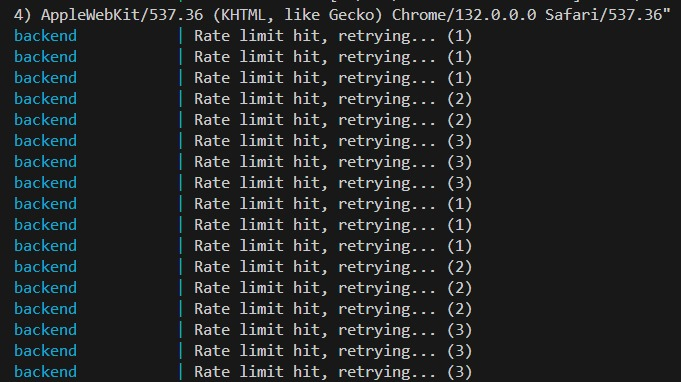

# Multilingual FAQ System (Developed By Shivdutt Pachori)


## Project Overview:
This project is about a *Multilingual FAQ System* which allows users to view FAQs in multiple languages. The backend and frontend is hosted on an AWS t2.micro where backend is written on Node.js, while the frontend  with static files (HTML, CSS, and JavaScript). The system also uses Redis for caching.



## Tech Stack
- *Frontend*: HTML, CSS, JavaScript
- *Backend*: Node.js, Express.js, Redis(cache), MongoDB
- *Unit Testing*: mocha/chai
- *Version control*: git 
- *Hosting*: AWS t2.micro (Backend and frontend)
- *ESlint*: For ensuring good code quality
- *docker*: For containerizing the application

WYSIWYG Editor Integrated using tiny.cloud service for answer field


## Getting Started

### 1. Clone the Repository
Clone the project from GitHub:
```bash
git clone https://github.com/achiveIt/BharatFD_Assignment.git
cd BharatFD_Assignment
```

### 2. Install Backend Dependencies
Navigate to the backend folder and install dependencies:
```bash
cd server
npm install
```

### 3. Set Up Environment Variables
Make sure you set up the necessary environment variables:
```bash
MONGODB_URL = "your-mongodb-url"
PORT = 8000
REDIS_URL = "redis-url"
```

### 4. Deployment 
The frontend is hosted on AWS t2.micro

*Frontend URL:*  
You can access the frontend at:  
[http://13.203.76.90/](http://13.203.76.90/)


## NOTE
There might be cases where you will not be able to see FAQs in different languages because of the API I'm using for transalating the FAQs, that API has quite a low rate limit and that's it is not able to convert the faqs into the desired languages, sorry for the inconvineience


## Testing the Application

### Testing the Admin Page
The admin has options to DELETE, ADD, EDIT a FAQ.
For now I have used /api/v1/Admin/faq API for adding FAQs. 
This project currently don't have any admin verification process but we can keep this for *Round - 2* phase.

### Testing the Backend
The backend is hosted on *AWS t2.micro* domain http://13.203.76.90:8000 . 
To test the API, you can use the following domain:
- *user API Endpoint*: http://13.203.76.90:8000/api/v1/User/faq (this will fetch you the FAQs in default language english)
- *Admin API Endpoint*: http://13.203.76.90:8000/api/v1/Admin/faq (NOTE:- currently admin only has methods POST, DELETE and PATCH)

Example API Usage:
```bash
# Create a new FAQ
curl -X POST http://13.203.76.90:8000/api/v1/Admin/faq -H "Content-Type: application/json" -d '{"question": "Question", "answer": "Answer"}'

# Update an existing FAQ (replace :faqid with the actual FAQ ID)
curl -X PUT http://13.203.76.90:8000/api/v1/Admin/faq/:faqid -H "Content-Type: application/json" -d '{"question": "Updated_question", "answer": "Updated_answer"}'

# Delete an existing FAQ (replace :faqid with the actual FAQ ID)
curl -X DELETE http://13.203.76.90:8000/api/v1/Admin/faq/:faqid

# Fetch FAQs in English (default)
curl http://13.203.76.90:8000/api/v1/User/faq

# Fetch FAQs in Hindi
curl http://13.203.76.90:8000/api/v1/User/faq?lang=hi

# Fetch FAQs in Bengali
curl http://13.203.76.90:8000/api/v1/User/faq?lang=bn
```

---


## Name: *Shivdutt Pachori*
## Email:[shivduttpachori7@gmail.com](shivduttpachori7@gmail.com)
## linkedin:[https://www.linkedin.com/in/shivdutt-pachori-7ab174262/](https://www.linkedin.com/in/shivdutt-pachori-7ab174262/)
